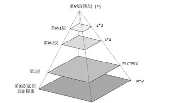
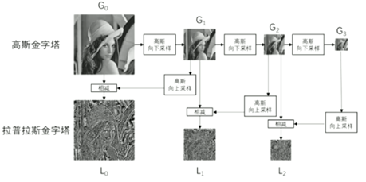
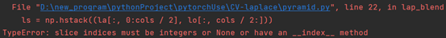

**Project1****报告-** **Image Blending**

 

**1、****引言**

本次实验使用拉普拉斯金字塔方法，来实现图像融合任务。

实验要求熟练掌握拉普拉斯金字塔的原理，并且独立使用代码复现拉普拉斯金字塔，实现将两张图片进行融合的任务。

 

**2、****相关工作**

 图像金字塔是由图像上采样和下采样的一系列不同分辨率的图像堆叠构成的。拉普拉斯金字塔是一种图像金字塔，名称来源于法国数学家皮埃尔·西蒙·拉普拉斯，他对信号处理和图像分析做出了重要贡献。

图像金字塔可以通过梯次向下采样获得，直到达到某个终止条件才停止采样，在向下采样中，层级越高，则图像越小，分辨率越低。拉普拉斯金字塔，可以用于捕捉图像中的细节和边缘信息。当我们对一张图片进行下采样，然后再上采样时，会出现信息丢失，因为这样只保留了图像的低频信息，而图像的高频信息丢失，而这些丢失的信息就构成了拉普拉斯金字塔。如果我们在上采样时加入拉普拉斯金字塔，就可得到有较高分辨率的原始图像。

 

**3、****方法介绍**

拉普拉斯金字塔与高斯金字塔有关，

**3.1****高斯金字塔的构建**

这是图像下采样的过程。首先进行高斯核卷积，高斯核常见有 3x3和5x5  两种：

​     

​     
 然后进行采样，删除所有的偶数行和列，这样图像分辨率越来越低。

 

**3.2**     
 **拉普拉斯金字塔构建**：

第i层的图像代表拉普拉斯金字塔中的第i层，等于高斯金字塔中的第i层与高斯金字塔中的第i+1层的向上采样结果之差。

 

 拉普拉斯金字塔保存的是损失部分信息，即图像中的细节和边缘信息。

**3.3****实验步骤**

(1).   求左图、右图的高斯金字塔GL、GR

(2).   求左图、右图的 laplace 金字塔 LapL 、 LapR

(3).   求 mask 图的高斯金字塔 Gmask

(4).   每个尺度下，根据当前尺度的 Gmask 拼接左、右图的 LapL,LapR ，最终得到拼接的 laplace 金字塔 LapBlend

(5).   生成最低分辨率的起始图。选取最低分辨率下的 GL,GR，根据同分辨率下的 Gmask 进行拼接，得到最低分辨率下的拼接结果ImgBlend1

(6).   从ImgBlend1开始，根据LapBlend逐层加和得到最高分辨率的拼接结果

 

**4、****实验**

**（****1****）实验过程**

实验数据：   

  
 实验用到了两张图片，是拉普拉斯金字塔的经典图像

实验在pycharm平台使用python3.9 + opencv-python4.7.0来实现

 

拉普拉斯金字塔实验用到了opencv中的两个关键的函数：

**(a)**pyrUp()函数

先对图像进行升采样（将图像尺寸行和列方向增大一倍），然后再进行高斯平滑；

**(b)**pyrDown()函数

先对图像进行高斯平滑，然后再进行降采样（将图像尺寸行和列方向缩减一半）；

 

**（****2****）实验困难**

 **(a)**实验过程中遇到了报错，这一部分是左右图拉普拉斯金字塔拼接部分

根据报错内容，slice即列表切片，所以意为切片应为整型或者none。所以加上int()后不再报错

 

**(b)**     
 实验过程中高斯金字塔和拉普拉斯金字塔的构建中有太多的代码量，所以进行了封装，使用列表来存储金字塔。

 

**(c)**由于苹果和橙子的图是由屏幕截图得到，所以图像大小不匹配，

>  ValueError: all the input array dimensions except for the concatenation axis
>  must match exactly,but along dimension 0,the array at index 0 has size 168 
> and the array at index 1 has size 167

 所以将两个图像调整为相同的大小

 

 

**(d)**图像融合过程的原理，在课堂上明白了高斯金字塔和拉普拉斯金字塔的原理，但是不清楚如何进行图像融合。在学习后明白了图像融合过程

\1.  首先计算得到 mask 的高斯金字塔，而若是左右进行拼接，则无需这一步，可以在每一步直接进行左右拼接。

\2.       
 将拉普拉斯金字塔LapL,LapR的每一层按照mask权重相加（mask高斯金字塔对应的层，在本项目中即为左右相加），得到混合的拉普拉斯金字塔LapBlend

 

\3.                 
 将高斯金字塔GL,GR的顶层按照 mask 的权重进行相加，作为复原起点，逐步上采样再加上拉普拉斯金字塔LapBlend的对应层，最终得到融合的图像

由于在存储金字塔时，两个拉普拉斯金字塔列表的第一个元素都是高斯金字塔的顶层，所以直接使用  拼接，即  ，为起始图像。

 

**（****3****）实验结果**

高斯金字塔的图像：可以看到从底层到顶层，图像分辨率逐层降低。     

 

​     
 拉普拉斯金字塔：可见拉普拉斯金字塔存储了边缘的细节信息。而由于代码将拉普拉斯金字塔从高斯金字塔的顶层开始构建，所以分辨率由低到高排列

 

​     
 最终结果，由结果可知，经过拉普拉斯金字塔的图像融合，苹果和橙子完美融合在一起，这说明，利用拉普拉斯金字塔辅助高斯金字塔进行无损图片缩放的原理，对低分辨率融合图像进行恢复，就可以在不损失图像精度的前提下平滑处理融合图像的拼接处。

 

 

 

**5、****总结**

在本次实验中我深刻理解了拉普拉斯金字塔和高斯金字塔的内部细节和实现方式。高斯金字塔是图像下采样得到的一系列不同分辨率的图像，拉普拉斯金字塔存储了第i层高斯金字塔的细节信息，等于高斯金字塔中的第i层与高斯金字塔中的第i+1层的向上采样结果之差。这样就补偿了高斯金字塔的下采样不可逆的缺点。

通过这次实验我理解了使用拉普拉斯金字塔进行图像融合的好处。直接的图像融合会造成拼接处不和谐。传统而言，第一种方法是对融合图像进行高斯平滑，但是这样会降低图像的分辨率，造成图像信息的丢失，第二种方法是对较低分辨率的图像进行融合，然后上采样，这样可以平滑处理拼接处，但是图像的下采样和上采样不可逆。因此，我们利用拉普拉斯金字塔辅助高斯金字塔进行无损图片缩放的原理，对低分辨率融合图像进行恢复，就可以在不损失图像精度的前提下平滑处理融合图像的拼接处。

通过本次实验我了解了计算机视觉实验的基本步骤和opencv库的使用。计算机视觉的实验包括图像载入，图像预处理(例如本次实验中，将两张图像转为相同分辨率)，模型构建，图像处理，结果显示几个步骤。Opencv库可以有效简化代码，使得短短的代码实现非常复杂的功能。后续我会进行更多的图像处理实验，在这一过程中锻炼自己的能力。

总之，本次实验难度适中，对我来说有挑战性但是也可以独立解决，我在这之中有很多的收获。

 